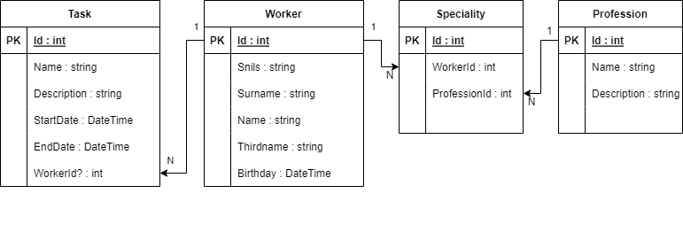

# Тестовое задание для ВЕГАСТАР - Вариант 2.
### Реализовать web-api для сущностей: Работник, Дежурство, Профессия.
- #### CRUD операциии
- #### Заполнение БД первичными данными при её создании 
- #### Пагинация
# Решение
- #### .NET Core 3.1
- #### MSSQL-Server
- #### EntityFrameworkCore
# Схема БД 

# Запуск 
- #### База данных создается автоматически 
